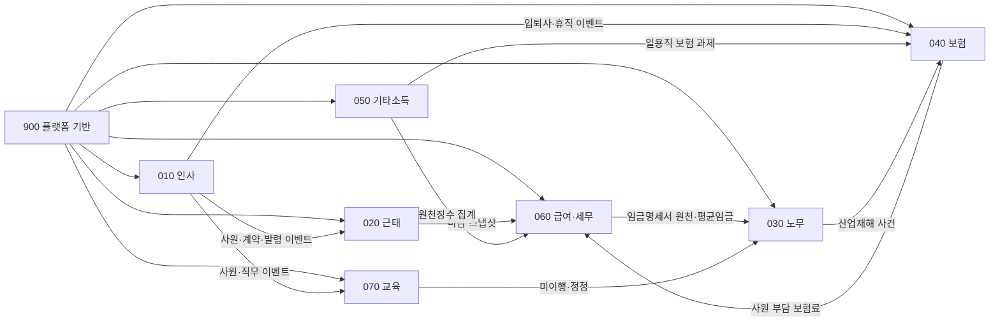
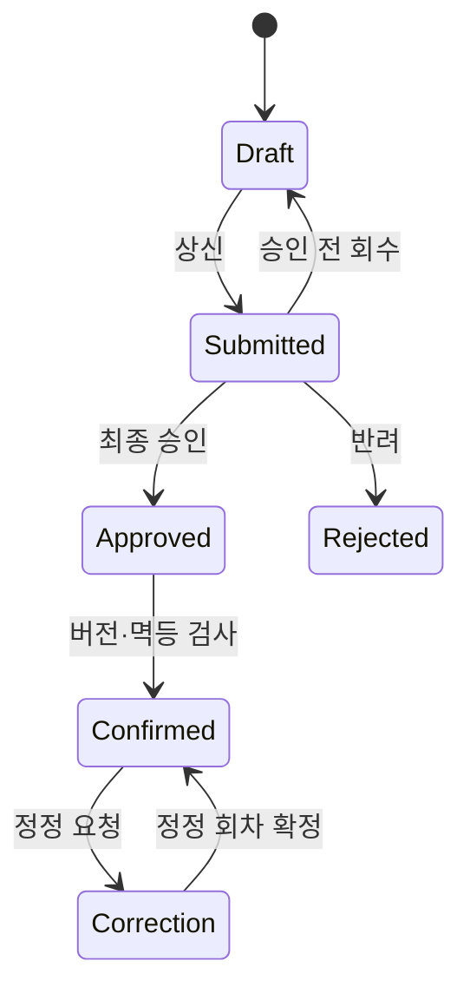

# Domain Design: 인사 · 노무 · 세무 통합 관리 시스템

> 근거: `specs/000-product/spec.md`, `specs/000-product/use-cases.md`
> 이 문서는 기술 스택을 선택하지 않는 논리 도메인 설계다. 데이터베이스와 배포 구조는 Q-3 등 열린 질문을 닫은 뒤 상세 설계한다.

## 1. 설계 원칙

- 사원 마스터는 010만 소유하고 다른 도메인은 사원 ID와 시점 정보로 참조한다.
- 회사·사업장·부서·공통 기준정보는 900이 소유한다.
- 도메인 간 직접 테이블 수정은 금지하고 공개 조회 계약과 도메인 이벤트만 사용한다.
- 계산 결과는 입력, 규칙 버전, 계산식과 반올림 결과를 스냅샷으로 보존한다.
- 확정된 기록은 수정하지 않고 정정 회차로 차액을 기록한다.
- 금액은 정수 최소 단위, 기간은 회사 시간대와 버전이 있는 영업일 달력으로 처리한다.

## 2. 바운디드 컨텍스트

| 컨텍스트 | 소유 데이터 | 외부 제공 | 외부 의존 |
|---|---|---|---|
| 900 플랫폼 | 계정, 권한, 조직, 기준정보, 결재, 알림, 파일, 이벤트, 감사 | 인증·권한, 결재 결과, 기준정보, 이벤트 전달 | 메일, 저장소, AI |
| 010 인사 | 사원, 계약, 가족, 발령, 소속 이력, 증명서 | 사원 시점 조회, 계약·입퇴사·발령 이벤트 | 900 조직·결재·파일 |
| 020 근태 | 근무제, 스케줄, 출퇴근, 휴가 이력·예약, 월 마감 | 근태 마감 스냅샷과 급여 입력 이벤트 | 010 계약·소속, 900 결재·달력 |
| 030 노무 | 취업규칙, 징계, 사건, 산업재해, 리스크 | 산업재해 사건, 임금명세서 | 010·060·070 이벤트, 900 결재·파일·AI |
| 040 보험 | 보험 자격, 보수 매핑, 요율, 보험료, 신고 회차 | 확정 사원 부담 보험료, 신고 결과 | 010·030·050·060 이벤트, 900 기준정보 |
| 050 기타소득 | 지급 대상자, 계약, 지급·정정 회차, 원천징수 | 보험 과제와 세무 집계 이벤트 | 900 결재·파일·기준정보 |
| 060 급여·세무 | 급여 회차, 지급·공제, 원천세, 연말정산, 퇴직소득 | 이체·명세서·세무 신고·평균임금 기초 | 010·020·040·050, 900 결재·파일 |
| 070 교육 | 과정, 차수, 대상 과제, 배정, 이수·증빙 | 미이행·정정 이벤트 | 010 사원·직무, 900 알림·파일 |

## 3. 컨텍스트 맵

## 4. 핵심 애그리거트와 불변조건

### Employee

루트: 사원

- 사번은 생성 후 변경하지 않는다.
- 한 시점에 유효한 사업장과 부서는 각각 하나다.
- 소속 변경은 발령을 통해서만 발생한다.
- 계약과 발령의 유효기간은 겹치지 않는다.
- 사원 등록과 등록 이벤트는 함께 성공하거나 함께 실패한다.

### AttendancePeriod

루트: 사원별 근태 월

- 출퇴근·휴가·스케줄 버전이 고정된 뒤에만 마감한다.
- 마감 중 원천 변경은 잠금 또는 버전 충돌로 거부한다.
- 마감 스냅샷과 급여 전달 이벤트는 함께 기록한다.
- 마감 후 변경은 재개방 또는 정정 절차로만 처리한다.

### LeaveLedger

루트: 사원·휴가 종류

- 잔여량은 부여, 사용, 조정 이력에서 계산한다.
- 접수된 신청은 승인 전까지 사용 예정량을 예약한다.
- 예약과 잔여 검사는 하나의 원자적 연산이다.
- 승인·반려·취소는 같은 예약을 정확히 한 번 전환하거나 해제한다.

### PayrollRun

루트: 사업장·급여 기간

- 같은 사업장과 기간에 활성 회차는 하나다.
- 인사·근태·보험 입력은 버전이 있는 스냅샷으로 고정한다.
- 지급 합계에서 공제 합계를 뺀 값은 실지급액과 일치한다.
- 음수 실지급액 또는 상세·대장 합계 불일치는 확정할 수 없다.
- 결재와 버전 검사를 통과한 하나의 요청만 확정한다.
- 확정 후 변경은 원 회차를 참조하는 정정 회차로만 처리한다.

### InsuranceFiling

루트: 사업장·보험·신고 종류·대상 기간

- 보험별 자격, 휴직 규칙과 보수 매핑이 모두 유효해야 산정한다.
- 산정 결과는 급여·자격·소속·규칙 버전을 보존한다.
- 같은 사건과 버전으로 신고 과제를 중복 생성하지 않는다.
- 확정 후에는 제출 파일을 교체하지 않고 정정 회차를 만든다.

### PaymentRun

루트: 지급 대상·귀속 기간·지급 회차

- 확정·정정·취소 상태 전이는 버전과 멱등 키로 한 번만 성공한다.
- 확정과 보험·세무 이벤트는 같은 트랜잭션에서 기록한다.
- 이체 자료는 사용한 지급 회차 버전을 보존한다.

### TrainingSession

루트: 과정 차수

- 사원과 차수 조합은 하나만 존재한다.
- 정원 확보와 배정은 원자적으로 처리한다.
- 이수 증빙의 수정은 새 버전과 취소 이력으로 남긴다.
- 미이행 정정은 기존 노무 리스크를 삭제하지 않고 상태를 갱신한다.

### ApprovalDocument

루트: 결재 문서

- 상신 시점의 결재선을 고정한다.
- 완료된 단계와 결재 이력은 수정하지 않는다.
- 최종 완료 이벤트는 한 번만 발행한다.

## 5. 공통 이벤트 봉투

모든 도메인 이벤트는 다음 논리 필드를 가진다.

| 필드 | 의미 |
|---|---|
| eventId | 전역 고유 이벤트 ID |
| eventType | 변경 의미 |
| schemaVersion | 페이로드 계약 버전 |
| aggregateId | 원천 애그리거트 ID |
| aggregateVersion | 원천 상태 버전 |
| businessDate | 업무 적용 기준일 |
| occurredAt | 실제 발생 시각 |
| traceId | 요청·로그 연결 ID |
| payload | 개인 식별정보를 최소화한 업무 데이터 |

생산자는 업무 변경과 이벤트를 같은 트랜잭션에 기록한다. 소비자는 소비자·이벤트 ID를 유일하게 저장하고 이전 애그리거트 버전을 반영하지 않는다. 실패 이벤트는 재시도 후 격리한다.

## 6. 상태 전이

- 상태 전이는 현재 버전과 허용 전이표를 검사한다.
- 확정 상태의 직접 수정과 삭제는 거부한다.
- 같은 멱등 키의 재요청에는 최초 결과를 반환한다.
- 원천 스냅샷 이후 변경이 있으면 확정을 거부한다.

## 7. 권한 경계

- 인증 주체, 기능 권한, 조직 범위, 민감 작업 권한을 각각 판정한다.
- 조회·내보내기·다운로드에도 같은 조직 범위를 적용한다.
- 민감정보 원문 조회, 급여 확정과 신고 확정은 일반 수정 권한과 분리한다.
- AI는 호출자의 조회 범위를 넘지 못하고 쓰기·확정 권한을 갖지 않는다.
- 민감 파일은 격리 검사 완료 후에만 접근할 수 있다.

## 8. 트랜잭션 경계

하나의 컨텍스트 안에서 반드시 원자적으로 처리할 항목:

- 사원 등록 + 체크리스트 + 등록 이벤트
- 휴가 잔여 확인 + 예약
- 근태 마감 + 스냅샷 + 급여 이벤트
- 급여 확정 + 대장 + 확정 이벤트
- 지급 확정 + 보험·세무 이벤트
- 교육 정원 차감 + 배정

컨텍스트 사이에서는 분산 트랜잭션을 사용하지 않는다. 원천 트랜잭션에 기록한 이벤트를 재시도 가능한 방식으로 전달하고 소비자가 멱등하게 처리한다.

## 9. 확정 기술 아키텍처

| 영역 | 결정 |
|---|---|
| 데이터베이스 | MySQL 8.4 LTS |
| 백엔드 | Java 21, Spring Boot, Gradle |
| 영속성 | Spring Data JPA와 Hibernate |
| 스키마 변경 | Flyway 마이그레이션, Hibernate DDL은 검증 전용 |
| 프론트엔드 | JavaScript, React, Vite |
| 통신 | REST/JSON API 계약 |
| 배포 구조 | 하나의 애플리케이션과 데이터베이스로 시작하는 모듈러 모놀리스 |

모듈은 010~900 바운디드 컨텍스트와 맞춘다. 각 모듈은 공개 API와 이벤트만 노출하고 다른 모듈의 JPA 엔티티나 Repository를 직접 참조하지 않는다. 기능 내부는 HTTP 어댑터, 유즈케이스, 도메인 모델, 영속성 어댑터 순으로 의존한다.

캐시, 마이크로서비스, CQRS, 메시지 브로커는 측정된 성능·배포·장애 격리 요구가 생기기 전까지 도입하지 않는다. 복잡한 목록과 통계 조회는 먼저 JPA projection 또는 명시적 쿼리로 해결하고 필요가 확인된 경우에만 조회 도구를 추가한다.

## 10. 상세 설계 전 결정할 항목

- Q-4 모바일 앱 및 푸시 알림
- Q-6 경비 청구 범위
- Q-7 기관별 제출 파일 형식
- Q-8 AI 제공자와 데이터 보존 정책
- 각 사업장의 급여 주기·지급일·일할 계산 정책
- 보험·세무·노무 기준정보의 최초 데이터 출처와 승인 절차
- 개인정보와 증빙별 보존기간, RPO·RTO와 훈련 주기

위 결정이 필요한 기능은 확정 전 구현하지 않는다. 영향을 받지 않는 스펙과 작업 분해는 진행할 수 있다.
