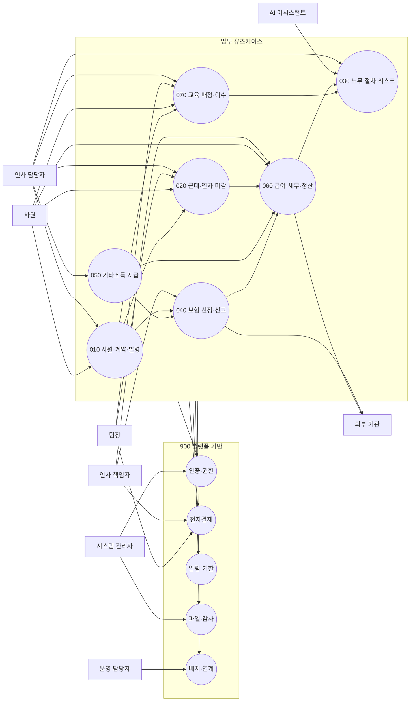

# 유즈케이스 모델

> 상위 문서: `specs/000-product/spec.md`
> 범위: 7개 업무 도메인과 900 플랫폼 기반의 사용자 목표 및 주요 연결

## 1. 액터

| 액터 | 책임 |
|---|---|
| 시스템 관리자 | 계정, 권한, 조직, 기준정보, 운영 설정 관리 |
| 인사 책임자 | 전사 인사·근태·급여·신고 최종 확정 |
| 인사 담당자 | 사원·계약·근태·급여·신고 자료 작성과 상신 |
| 팀장 | 소속 조직 근태·휴가·교육 승인 |
| 사원 | 본인 근태·휴가·증명서·급여·교육 확인 |
| 운영 담당자 | 배치·연계·복구 실패 처리 |
| AI 어시스턴트 | 비식별 자료를 이용한 초안과 진단 제공 |
| 외부 기관 | 시스템 밖에서 제출 파일을 접수하는 대상 |

## 2. 전체 유즈케이스 다이어그램

## 3. 핵심 업무 흐름

### UC-001 입사 처리

1. 인사 담당자가 사원과 계약을 등록한다.
2. 시스템은 사원·체크리스트·등록 이벤트를 한 트랜잭션에 기록한다.
3. 근태는 근무제 설정 과제를, 보험은 취득 신고 과제를, 교육은 법정교육 과제를 생성한다.
4. 일부 소비자가 실패하면 동일 이벤트를 재시도하고 중복 과제를 만들지 않는다.

관련 요구사항: 010 FR-001, FR-038, FR-039; 900 FR-063, FR-064.

### UC-002 근태 마감과 급여 확정

1. 근태 원본과 휴가 승인을 대상 월 기준 시각으로 고정한다.
2. 근태 집계와 급여 전달 이벤트를 원자적으로 확정한다.
3. 급여 회차가 계약·근태·보험 입력 스냅샷을 고정한다.
4. 지급액, 보험료, 원천세, 공제액과 실지급액을 순서대로 계산한다.
5. 결재 완료 후 하나의 요청만 급여를 확정한다.
6. 이체 자료와 임금명세서 원천 데이터를 생성한다.

관련 요구사항: 020 FR-043~046; 060 FR-034~042; 900 FR-065, FR-066.

### UC-003 휴가 신청과 승인

1. 사원이 휴가를 신청한다.
2. 시스템은 잔여 이력과 기존 예약을 원자적으로 확인해 사용량을 예약한다.
3. 결재선이 구성되고 팀장에게 알림이 간다.
4. 승인하면 예약을 사용 이력으로 전환하고, 반려·취소하면 예약을 해제한다.

관련 요구사항: 020 FR-023~029, FR-045; 900 FR-022~030.

### UC-004 보험 신고

1. 입사·퇴사·휴직·복직·보수 변경 이벤트를 수신한다.
2. 보험별 자격과 휴직 처리 규칙, 급여 항목별 보수 매핑을 적용한다.
3. 신고 기한과 신고 자료를 생성한다.
4. 결재 후 원천 스냅샷과 상태 버전을 확인해 한 번만 확정한다.
5. 외부 기관 전송은 하지 않고 제출 파일과 증빙만 보존한다.

관련 요구사항: 040 FR-001~035; 900 FR-035, FR-063~066.

### UC-005 급여·신고 정정

1. 담당자가 확정 결과의 오류와 정정 사유를 등록한다.
2. 원 확정 자료는 변경하지 않는다.
3. 새 정정 회차에서 보험료·세액·실지급 차액을 계산한다.
4. 추가 이체 또는 회수, 재신고 대상을 생성한다.
5. 중복 정정 요청은 멱등 키와 상태 버전으로 차단한다.

관련 요구사항: 040 FR-035; 050 FR-028; 060 FR-041~043; 900 FR-065.

### UC-006 교육 미이행 관리

1. 입사·소속·직무를 기준으로 교육 대상을 판정한다.
2. 정원을 원자적으로 확보해 과정에 배정한다.
3. 진도·출석·평가와 증빙으로 이수를 확정한다.
4. 미이행 또는 정정 결과를 노무관리로 전달한다.
5. 노무관리는 같은 사건을 중복 생성하지 않고 리스크 상태를 갱신한다.

관련 요구사항: 070 FR-001~029; 030 FR-025~027; 900 FR-064.

## 4. 공통 예외 흐름

- 권한 없음: 자원의 존재 여부를 노출하지 않고 거부하며 감사 이력을 남긴다.
- 기준정보 없음: 이전 값을 자동 사용하지 않고 계산·확정을 중단한다.
- 원천 버전 변경: 확정을 거부하고 최신 입력으로 재계산하게 한다.
- 중복 요청: 최초 결과를 반환하고 산출물을 추가 생성하지 않는다.
- 연계 실패: 재시도 후 격리하며 운영 담당자에게 알린다.
- 민감 파일 실패: 격리 상태에서 제거하고 업무 처리에 사용하지 않는다.
- 확정 후 오류: 원본을 수정하지 않고 정정 회차를 생성한다.

## 5. 추적성 기준

각 상세 설계와 작업은 하나 이상의 UC와 FR·AC를 함께 참조한다. 유즈케이스에 없는 기능을 구현하려면 먼저 이 문서와 해당 도메인 스펙을 변경한다.
