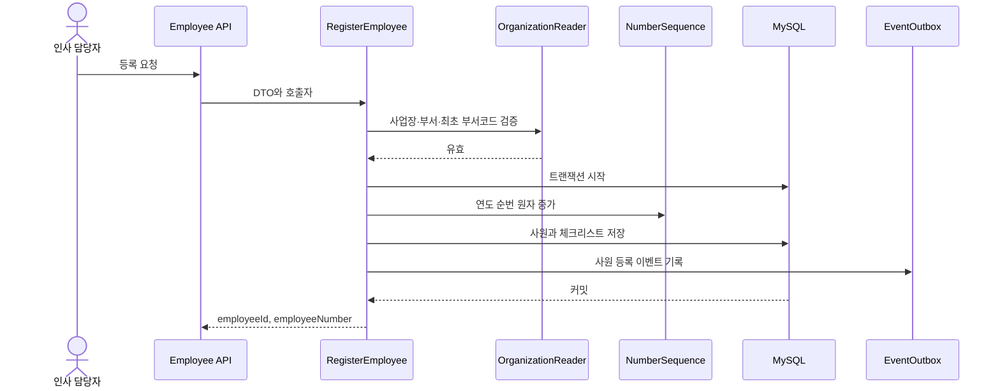

# Design: 010 인사관리 FR-001~009

> 근거: `specs/010-인사관리/spec.md` FR-001~009, AC-001~009  
> 상위 설계: `specs/000-product/design.md`  
> 상태: 구현 전 상세 설계

## 1. 범위와 완료 경계

이 문서는 사원 등록, 인사기록카드의 기본 부속정보, 자격 만료, 수습 종료, 외국인 체류정보를 설계한다. 인증·권한, 조직 마스터, 실제 파일 저장과 외부 알림 채널은 900 플랫폼이 소유한다.

900 구현 전에는 포트와 계약, 단위·통합 테스트용 대역만 만든다. 실제 권한과 조직 유효성 검사가 연결되기 전에는 AC-001을 운영 환경에서 완료로 판정하지 않는다. 외국인등록번호 원문 조회는 이번 범위에 포함하지 않는다.

## 2. 구조

하나의 Spring Boot 애플리케이션과 MySQL 데이터베이스로 시작하는 모듈러 모놀리스를 사용한다.

```text
backend/src/main/java/.../
├─ hr/
│  ├─ employee/
│  │  ├─ api/
│  │  ├─ application/
│  │  ├─ domain/
│  │  └─ infrastructure/
│  ├─ record/
│  └─ reminder/
└─ platform/
   └─ port/

frontend/src/
├─ features/employee/
└─ shared/
```

HTTP 계층은 요청·응답 변환만 하고, 유즈케이스가 트랜잭션과 업무 흐름을 제어한다. 도메인 모델은 사번 불변, 고용형태, 기간과 외국인 조건을 검증한다. JPA 엔티티는 API 응답으로 직접 반환하지 않는다.

## 3. 기술 기준

| 영역 | 결정 |
|---|---|
| DB | MySQL 8.4 LTS |
| Backend | Java 21, Spring Boot, Gradle |
| ORM | Spring Data JPA, Hibernate |
| Migration | Flyway |
| Frontend | JavaScript, React, Vite |
| API | REST, JSON |
| 시간대 | Asia/Seoul |
| 알림 | 초기에는 시스템 내부 알림 포트, 외부 채널은 후속 연결 |

Hibernate는 스키마를 자동 변경하지 않고 `ddl-auto=validate`로 Flyway 결과만 검증한다. 기본 연관 로딩은 LAZY로 두며 FR-003은 전용 조회에서 필요한 데이터만 명시적으로 조회한다.

## 4. 도메인 모델

### 4.1 Employee 애그리거트

Employee가 등록 흐름의 애그리거트 루트다.

불변조건:

- employeeNumber는 생성 후 변경하지 않는다.
- employmentType은 REGULAR, CONTRACT, DAILY, PART_TIME, DISPATCHED, FREELANCER 중 하나다.
- workplaceId와 departmentId는 900 조직 식별자를 참조하며 인사 모듈이 마스터를 생성하지 않는다.
- foreignWorker가 true이면 nationality, visaType, stayFrom, stayUntil, encryptedAlienRegistrationNumber가 필요하다.
- stayUntil은 stayFrom보다 빠를 수 없다.
- probationEndDate는 선택값이며 hireDate보다 빠를 수 없다.

### 4.2 사번

형식은 `YYNNNNDD`다.

| 부분 | 의미 |
|---|---|
| YY | 입사연도 뒤 2자리 |
| NNNN | 해당 연도 회사 전체 입사 순번, 0001~9999 |
| DD | 최초 입사 부서의 재사용되지 않는 2자리 코드 |

`employee_number_sequence`는 연도를 기본키로 하고 마지막 발급 순번을 저장한다. 채번 시 해당 연도 행을 비관적 잠금하거나 MySQL 원자 갱신으로 증가시키고 같은 트랜잭션에서 Employee를 저장한다. 9999를 넘으면 등록을 거부한다. 사번에는 최초 부서 코드가 남으며 현재 소속 판단에 사용하지 않는다.

### 4.3 부속정보

| 모델 | 핵심 필드 | 검증 |
|---|---|---|
| FamilyMember | name, relationship, birthDate, cohabiting, dependent, disabled, deductionEligible | employee 종속 |
| Education | startDate, endDate, institution, major, evidenceFileId | endDate >= startDate |
| Career | startDate, endDate, institution, job, evidenceFileId | endDate >= startDate |
| Certification | name, issuer, acquiredDate, expiresOn | 만료일이 있을 때 취득일보다 빠르지 않음 |
| ForeignWorkerProfile | nationality, visaType, stayFrom, stayUntil, encryptedRegistrationNumber | 외국인일 때 필수 |

파일은 900의 식별자만 저장한다. 실제 업로드와 안전 검사는 900 파일 포트가 준비된 뒤 연결한다.

## 5. 영속성 모델

| 테이블 | 목적 | 주요 제약 |
|---|---|---|
| employees | 사원 마스터 | employee_number CHAR(8) UNIQUE NOT NULL, version NOT NULL |
| employee_number_sequences | 연도별 채번 | year PK, last_value 0~9999 |
| onboarding_checklists | 입사 서류 체크리스트 | employee_id UNIQUE |
| family_members | 가족 | employee_id FK |
| educations | 학력 | employee_id FK, 기간 검사 |
| careers | 경력 | employee_id FK, 기간 검사 |
| certifications | 자격 | employee_id FK |
| foreign_worker_profiles | 외국인 정보 | employee_id PK/FK |
| reminder_deliveries | 중복 알림 방지 | reminder_type+employee_id+target_id+due_date UNIQUE |

내부 식별자는 사번과 분리한다. 낙관적 충돌 감지를 위해 변경 가능한 루트에 version을 둔다. 주민·외국인등록번호는 검색 가능한 평문 컬럼이나 로그에 두지 않는다.

## 6. API 계약

### 6.1 사원 등록

`POST /api/hr/employees`

필수 입력:

- name
- birthDate
- phone
- hireDate
- employmentType
- workplaceId
- departmentId
- position
- idempotencyKey

조건부 입력:

- probationEndDate
- foreignWorker
- nationality, visaType, stayFrom, stayUntil, alienRegistrationNumber

응답은 201과 employeeId, employeeNumber를 반환한다. 정의 밖 고용형태와 잘못된 기간은 400, 중복 멱등 요청은 최초 결과, 조직 검증 실패는 422, 연간 순번 소진은 409로 응답한다.

### 6.2 인사기록카드

`GET /api/hr/employees/{employeeId}/record`

한 응답에 employee, familyMembers, educations, careers, certifications, appointments, contracts 일곱 영역을 반환한다. 구현되지 않은 발령·계약 영역도 빈 배열과 안정된 필드 형태를 반환하되 해당 기능이 완료됐다고 판정하지 않는다.

### 6.3 부속정보

- `POST /api/hr/employees/{id}/family-members`
- `POST /api/hr/employees/{id}/educations`
- `POST /api/hr/employees/{id}/careers`
- `POST /api/hr/employees/{id}/certifications`

수정 API는 employeeNumber를 입력으로 받지 않는다. Entity 대신 Request/Response DTO를 사용한다.

## 7. 등록 트랜잭션



FR-001의 등록과 체크리스트, FR-038의 이벤트는 같은 트랜잭션에서 성공하거나 모두 실패한다. 구현 티켓이 FR-001~009만 다루더라도 이 원자성 경계를 훼손하지 않는다.

## 8. 외부 포트

| 포트 | 책임 | 900 연결 전 |
|---|---|---|
| CurrentActorProvider | 호출자 식별 | 테스트 대역만 사용 |
| AuthorizationChecker | 사원 등록·조회 권한 | 운영 완료 판정 보류 |
| OrganizationReader | 사업장·부서·부서코드 유효성 | 테스트 대역만 사용 |
| FileStorage | 증빙 fileId 검증 | 실제 첨부 완료 판정 보류 |
| NotificationSender | 내부 알림 생성 | 저장형 대역으로 검증 |
| SensitiveValueCipher | 민감값 암·복호화 | 키는 소스 밖에서 주입 |

포트는 외부 경계에만 둔다. 단일 구현만 존재하는 내부 서비스마다 인터페이스나 팩토리를 추가하지 않는다.

## 9. 알림

매일 09:00 Asia/Seoul에 대상 조회 작업을 실행한다.

- 자격증 expiresOn = 오늘+30일: 본인과 인사 담당자
- probationEndDate = 오늘+14일: 인사 담당자
- stayUntil = 오늘+60일: 인사 담당자

알림 기준일은 설정 가능한 코드 테이블이 아니라 현재 확정된 요구사항 수치로 사용한다. 재실행 시 reminder_type, employee_id, target_id, due_date의 고유 제약으로 중복 발송을 막는다. 외부 이메일·문자와 메시지 브로커는 도입하지 않는다.

## 10. 개인정보와 로그

외국인등록번호는 AES-256-GCM 같은 인증 암호 방식으로 저장하고 키는 환경 설정 또는 비밀 저장소에서 주입한다. 실제 키, 원문, 복호화 결과를 로그·예외·감사 payload에 기록하지 않는다. 일반 응답에는 마스킹 값만 제공하고 원문 조회 API는 FR-029~031과 권한 기반이 준비될 때까지 만들지 않는다.

## 11. 프론트엔드 상태

- 폼 입력과 검증 오류는 등록 화면의 로컬 상태가 소유한다.
- 서버 사원 데이터는 API 응답이 단일 원천이며 전역 상태로 복제하지 않는다.
- 고용형태는 서버가 제공하는 허용 코드와 동일한 고정 선택지로 표시한다.
- 외국인 선택 시에만 조건부 필드를 표시하지만 서버가 같은 조건을 다시 검증한다.
- 인사기록카드는 일곱 영역을 한 API 응답으로 받아 표시한다.

## 12. 검증

| 대상 | 검증 |
|---|---|
| AC-001 | 사원·체크리스트·이벤트가 함께 커밋·롤백됨 |
| AC-002 | DTO·서비스·Repository 경로에서 사번 변경 불가 |
| AC-003 | 일곱 영역이 한 응답에 존재 |
| AC-004 | 부양가족 지정 시 deductionEligible 저장 |
| AC-005 | 종료일이 시작일보다 빠르면 400과 저장 0건 |
| AC-006 | 정확히 만료 30일 전 한 번씩 두 대상에게 알림 |
| AC-007 | 여섯 코드 외 값 거부 |
| AC-008 | 수습 종료 14일 전 한 번 알림 |
| AC-009 | 외국인 조건부 필수값과 체류 만료 60일 전 알림 |
| 사번 동시성 | 같은 해 동시 등록에서 중복 0건 |
| 보안 | DB·로그·API 일반 응답에서 등록번호 평문 0건 |
